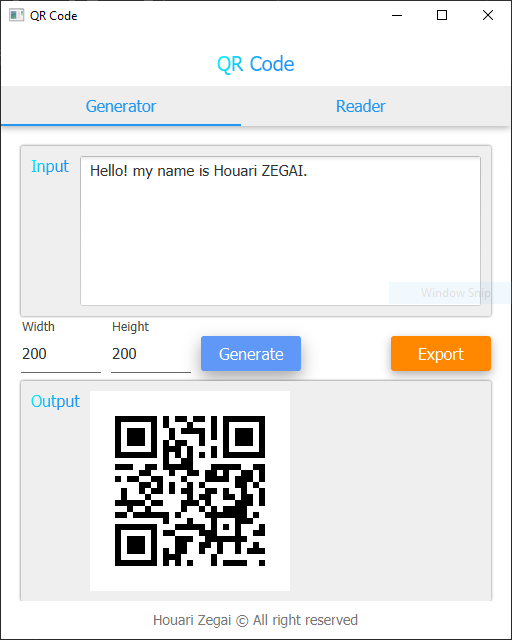
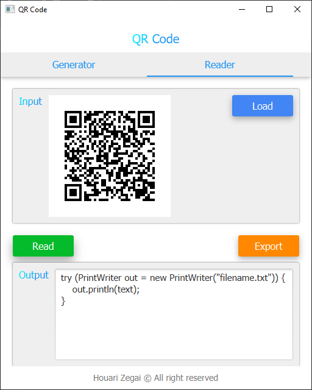

## QR Code FX

#### Features
* Very simple to use
* Generate QR Code image from text and export the generated image (Encoder)
* Read text from QR Code image and export the generated text (Decoder)

#### Requirements
* Java 8

#### Screenshoot
| QR Code Generator  | QR Code Reader |
|:-------------------:|:-------------------:|
|  |  |

#### Contributing 💡
If you want to contribute to this project and make it better with new ideas, your pull request is very welcomed.
If you find any issue just put it in the repository issue section, thank you.
